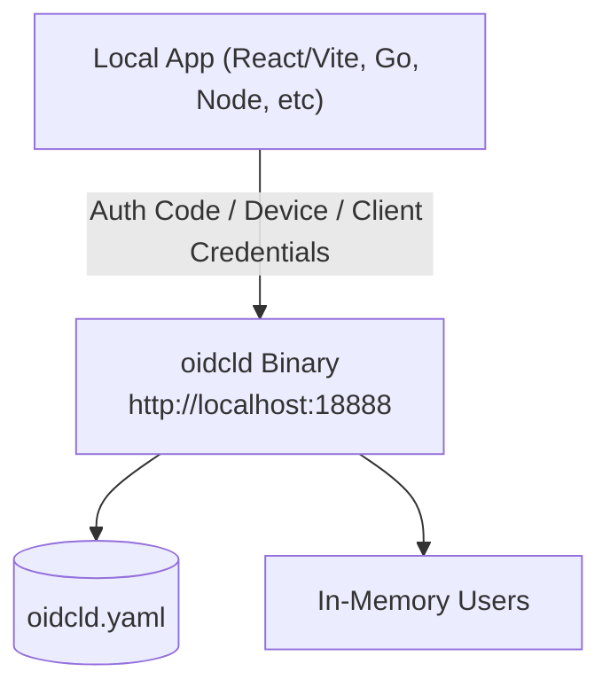
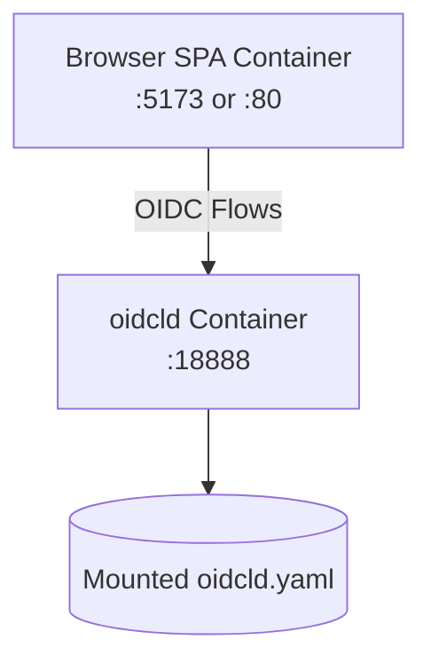
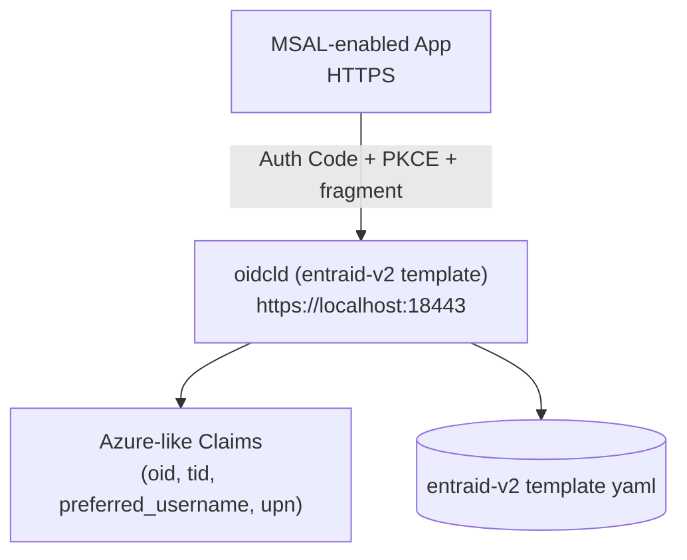

# ローカル開発用 OpenID Connect: OIDCLD

テストと開発のために設計されたフェイクな OpenID Connect アイデンティティプロバイダー (IdP)。

[](https://github.com/shibukawa/oidcld/actions/workflows/ci.yml)
[](https://github.com/shibukawa/oidcld/releases)
[](go.mod)
[](LICENSE.md)
[](https://github.com/shibukawa/oidcld/pkgs/container/oidcld)

English: see [README.md](README.md)

クイックリンク: [llms.txt](llms.txt) | [設定ガイド](docs/config.ja.md)

## 目次
- [用語](#用語)
- [主な機能](#主な機能)
- [ユースケース](#ユースケース)
- [3. EntraID 互換モード (MSAL / Azure スタイルのクレーム)](#3-entraid-互換モード-msal--azure-スタイルのクレーム)
- [HTTPS 設定](#https-設定)
- [OIDCLD 向けの MSAL 設定例](#oidcld-向けの-msal-設定例)
- [CLI サマリー](#cli-サマリー)
- [セキュリティ上の制約](#セキュリティ上の制約)
- [追加ドキュメント](#追加ドキュメント)
- [ライセンス](#ライセンス)


## 用語

このプロジェクトは xUnit テストパターンの用語を用いて目的と機能を明確にしています。

### フェイク vs モック
- フェイク: 簡略化された動作を持つ実用的な実装でテストに適します。実際のビジネスロジックは持ちますが、インメモリ保管などのショートカットを取ります。
- モック: 相互作用を記録し期待値で検証するテスト用オブジェクト。

### このプロジェクトは「フェイク」です
この OpenID Connect アイデンティティプロバイダーは以下の理由からフェイク実装です:
- 実際のプロトコル準拠を満たす機能的な OIDC サーバーを提供
- 簡略化された構成 (インメモリ、テスト証明書、ユーザー選択 UI)
- テスト目的で実際の認証フローを有効化
- モックのように特定の相互作用検証や期待値アサートは行わない

----


ログイン画面: パスワード不要—クリックでログイン。テストに便利。開発環境だけのログイン回避はもう不要です。

`/login` には環境名、色、Markdownメモも出せます。

```yaml
oidc:
  login_ui:
    env_title: "Staging"
    info_markdown_file: "./docs/login-links.staging.md"
```

----

## 主な機能
- ローカルテスト環境向けの OpenID Connect IdP (❌ 本番環境では使用しないでください)
  - 複数フロー: Authorization Code / Client Credentials / Device / Refresh Token
  - PKCE 対応: セキュリティ強化のための Proof Key for Code Exchange
  - リフレッシュトークン: 長期セッション向けに任意で発行/検証
  - End Session: RP-Initiated Logout (ディスカバリ掲載は設定可能)
  - OpenID ディスカバリ: `/.well-known/openid-configuration`
- ローカルテストに最適
  - Docker との相性良好: DB などの永続ストレージ不要。単一の設定ファイルで動作
  - 迅速なログイン: ユーザー名をクリックするだけ (パスワード不要)
  - カスタム JWT クレーム: YAML で追加クレームを付与可能
  - Edge/Web Gateway: Virtual Host ルーティング、reverse proxy、SPA フォールバック付き静的配信、OpenAPI モック、route 単位の JWT 認可
- EntraID/AzureAD 互換:
  - MSAL.js でのテストに対応

## ユースケース

起動スタイルは「単体バイナリ / コンテナ」の 2 種類、API は「標準 OIDC / EntraID 互換」の 2 モードがあります。

### 1. シンプルなローカルサーバー (標準 OIDC)

ローカルに `oidcld` バイナリをそのまま実行。最速の反復と最小の構成で試せます。


```mermaid
flowchart TB
  DevApp["Local App (React/Vite, Go, Node, etc)"] -->|Auth Code / Device / Client Credentials| OIDCLD[oidcld Binary<br/>http://localhost:18888]
  OIDCLD --> Config[(oidcld.yaml)]
  OIDCLD --> Users[In-Memory Users]
```

ポイント:
- デフォルトは HTTP (ポート 18888)
- 必要なのは YAML (`oidcld.yaml`) + 生成される鍵ペアのみ
- クリックログインのユーザー選択 UI (パスワード不要)
- プロトタイピングやユニット/統合テストに最適

クイックスタート:
```bash
./oidcld init            # 設定と鍵を生成
./oidcld                 # http://localhost:18888 で起動
open http://localhost:18888/.well-known/openid-configuration
```

HTTPS は後から mkcert で証明書を作成し、`--cert-file/--key-file` で指定して有効化できます。

ローカル開発向けの managed モードを使う場合は、[oidcld.yaml](oidcld.yaml) の `certificate_authority` と `console` を設定します。OIDCLD は `http://127.0.0.1:18889/console/` に Developer Console を出し、設定された `ca_dir` 配下にローカル root CA を作成し、root 証明書と install / uninstall script のダウンロードを提供します。

同じ runtime でローカル向けの edge/web gateway としても使えます。`reverse_proxy.hosts[]` は Virtual Host テーブルとして動作し、各 route は upstream proxy、`spa_fallback` 付き静的配信、または OpenAPI ベースのモック応答を選べます。さらに route ごとに `scope` や `aud` などの claim 条件で self-issued Bearer token を検証する gateway ルールを設定でき、OIDCLD 発行 token は署名と日時を付け直して upstream へ replay できます。

frontend をローカルで触るときは VS Code の `dev` タスクを使います。通常の `serve` フローで backend を起動しつつ、Vite dev server が `/console/api/*` を Developer Console listener に proxy するため、Vue の変更がすぐ反映されます。配布向けに近い build を行うときは `build` タスクを使い、`web/admin` をビルドして backend の embed 用ディレクトリへ同期し、その後で Go バイナリをビルドします。

インストール (Option 1: Go install; Go 1.24+):
```bash
go install github.com/shibukawa/oidcld@latest
```
`$GOBIN` を `PATH` に通してください。

インストール (Option 2: GitHub Releases からダウンロード)
1. [GitHub Releases](https://github.com/shibukawa/oidcld/releases) へアクセス
2. ご利用の OS/アーキテクチャ向けアーカイブをダウンロード
3. (Unix 系) 実行権限付与: `chmod +x oidcld`

現在のリリースバイナリ配布ターゲット:
- `oidcld-linux-amd64.tar.gz`
- `oidcld-linux-arm64.tar.gz`
- `oidcld-darwin-arm64.tar.gz`
- `oidcld-windows-amd64.zip`
- `oidcld-windows-arm64.zip`

チェックサム検証:
```bash
# Linux AMD64 アーカイブの例
archive="oidcld-linux-amd64.tar.gz"
curl -fsSL "https://github.com/shibukawa/oidcld/releases/latest/download/${archive}" -o "${archive}"
curl -fsSL "https://github.com/shibukawa/oidcld/releases/latest/download/SHA256SUMS.txt" -o SHA256SUMS.txt
grep " ${archive}$" SHA256SUMS.txt | sha256sum -c -
```

macOS Gatekeeper 対応 (ダウンロードしたバイナリ向け):
```bash
chmod +x oidcld
xattr -l ./oidcld
xattr -d com.apple.quarantine ./oidcld
```

他リポジトリの GitHub Actions から利用する例 (latest release):

```yaml
- name: oidcld を取得 (Linux/macOS)
  if: runner.os != 'Windows'
  shell: bash
  run: |
    set -euo pipefail
    case "${RUNNER_OS}-${RUNNER_ARCH}" in
      Linux-X64)   archive="oidcld-linux-amd64.tar.gz" ;;
      Linux-ARM64) archive="oidcld-linux-arm64.tar.gz" ;;
      macOS-ARM64) archive="oidcld-darwin-arm64.tar.gz" ;;
      *) echo "unsupported runner: ${RUNNER_OS}-${RUNNER_ARCH}"; exit 1 ;;
    esac
    curl -fsSL "https://github.com/shibukawa/oidcld/releases/latest/download/${archive}" -o "${archive}"
    tar -xzf "${archive}"
    chmod +x oidcld
    echo "${PWD}" >> "${GITHUB_PATH}"

- name: oidcld を取得 (Windows)
  if: runner.os == 'Windows'
  shell: pwsh
  run: |
    switch ("$env:RUNNER_ARCH") {
      "X64" { $archive = "oidcld-windows-amd64.zip" }
      "ARM64" { $archive = "oidcld-windows-arm64.zip" }
      default { throw "unsupported runner architecture: $env:RUNNER_ARCH" }
    }
    Invoke-WebRequest -Uri "https://github.com/shibukawa/oidcld/releases/latest/download/$archive" -OutFile $archive
    Expand-Archive -Path $archive -DestinationPath . -Force
    Add-Content -Path $env:GITHUB_PATH -Value $PWD
```

上記の後続 step で、Unix 系は `oidcld --help`、Windows は `./oidcld.exe --help` を実行できます。

### 2. Docker モード (標準 OIDC)

oidcld と SPA/API をコンテナで実行。チーム/CI で再現性のある環境を構築。

```bash
docker pull ghcr.io/shibukawa/oidcld
```


```mermaid
flowchart TB
  Browser[Browser SPA Container<br/>:5173 or :80] -->|OIDC Flows| OIDCLDContainer[oidcld Container<br/>:18888]
  OIDCLDContainer --> Volume[(Mounted oidcld.yaml)]
```

ポイント:
- `oidcld.yaml` はボリュームで共有 (その他の設定は環境変数で指定可能)
- ヘルスチェックで依存サービスの起動順制御が可能
- ローカルモードと同等のフロー。設定ファイルのホットリロードも可能

Compose 最小例 (抜粋):

```yaml
services:
  oidcld:
    image: ghcr.io/shibukawa/oidcld:latest
    ports:
      - "18888:18888"
    volumes:
      - ./oidcld.yaml:/app/oidcld.yaml:ro
    command: ["serve", "--config", "/app/oidcld.yaml"]
```

使い方:
```bash
./oidcld init                # oidcld.yaml を生成
docker compose up -d         # スタック起動
curl http://localhost:18888/health
```

### 3. EntraID 互換モード (MSAL / Azure スタイルのクレーム)

MSAL 連携向けに Azure AD (EntraID) の振る舞いを模倣します。HTTPS とフラグメントレスポンスが必要です。


```mermaid
flowchart TB
  MSALApp[MSAL-enabled App<br/>HTTPS] -->|Auth Code + PKCE + fragment| OIDCLDEntra["oidcld (entraid-v2 template)<br/>https://localhost:18443"]
  OIDCLDEntra --> Claims["Azure-like Claims<br/>(oid, tid, preferred_username, upn)"]
  OIDCLDEntra --> ConfigEntra[(entraid-v2 template yaml)]
```

ポイント:
- `./oidcld init --template entraid-v2` でスキャフォールド
- `nonce_required` と適切な issuer 形式を強制
- Azure 風のクレーム (例: `oid`, `tid`, `preferred_username`)
- 単一 audience の `aud` クレームは EntraID 互換性を優先して既定で文字列出力。配列で出したい場合は `oidcld.aud_claim_format: array` を指定
- `/{tenant}/v2.0/.well-known/openid-configuration` や `/{tenant}/oauth2/v2.0/authorize` など Microsoft 風の v2 endpoint alias を提供
- `common`, `organizations`, `customers`, `contoso.onmicrosoft.com` の tenant alias を許可し、`/v2.0/.well-known/openid-configuration` のような tenant なし v2 path も受け付ける
- EntraID v1 モードでも、`v2.0` セグメントがない同等の alias tenant / tenantless path を受け付ける
- 起動ログの EntraID endpoint 表示は `{tenant}` プレースホルダーで短くまとめ、tenant なし request は warning を出し、`/health` request は access log に出さない
- MSAL ライブラリは HTTPS が必須

クイックスタート:
```bash
./oidcld init --template entraid-v2
./oidcld --cert-file localhost.pem --key-file localhost-key.pem
curl -k https://localhost:18443/.well-known/openid-configuration
```

トラブルシューティング:
- `oidcld init` が完了しても `oidcld.yaml` が生成されない (`v0.1.2` のみ) → 新しいリリースへ更新してください。暫定回避策: `oidcld init oidcld.yaml --template standard`
- 不正なオリジンの MSAL エラー → HTTPS と信頼済み証明書 (mkcert インストール) を確認
- リフレッシュトークンが無い → `offline_access` スコープを追加し、設定でリフレッシュを有効化
- EntraID 風に単一 audience の `aud` を常に文字列にしたい → 既定の `oidcld.aud_claim_format: string` を利用し、配列が必要なクライアントだけ `array` へ変更

## CLI サマリー

ローカル開発/テスト向けのコマンドです。MCP は現時点では除外しています。

- `oidcld init`: テンプレートから設定を初期化
  - フラグ: `--template standard|entraid-v1|entraid-v2`, `--tenant-id`, `--https`, `--autocert`, `--acme-server`, `--domains`, `--email`, `--port`, `--issuer`, `--overwrite`

- `oidcld serve`: OIDC サーバーを起動
  - フラグ: `--config oidcld.yaml`, `--port`, `--http-readonly-port`, `--watch`, `--cert-file`, `--key-file`, `--verbose`
  - 備考: HTTP は既定で `18888`、HTTPS は既定で `18443` を使います。HTTPS 時の `--http-readonly-port` は既定で `18888` になり、discovery/JWKS/health だけを公開します。さらに `serve` listener ではローカルアクセスフィルタが既定で有効です。`Forwarded` / `X-Forwarded-For` が無い request は loopback またはローカル私設アドレス (`127.0.0.0/8`, `::1`, `fc00::/7`, `10/8`, `172.16/12`, `192.168/16`) の送信元のみ許可し、forward 系ヘッダー付き request は `oidcld.access_filter.max_forwarded_hops` を既定 `0` から上げない限り拒否します。`--port` を指定し、issuer のホストがローカル (`localhost`/loopback) の場合は、issuer のポートも同じ値に同期されます。

- `oidcld health`: サーバーヘルスをチェック
  - フラグ: `--url`, `--port`, `--config`, `--timeout`
  - 備考: `--url` を省略すると設定から自動検出。コンテナ環境で `OIDCLD_CONFIG` がある場合は localhost に接続し、自己署名証明書向けに TLS 検証をスキップします。

## セキュリティ上の制約

このプロジェクトは開発/テスト専用です。本番環境では使用しないでください。

- 任意の `client_id` を受け付けます: クライアント登録や許可リストはありません。
- `redirect_uri` のホワイトリストはありません: リクエストの `redirect_uri` を動的に許可します。
- クライアントシークレットは不要/未検証: ローカルテスト専用の挙動です。
- 署名鍵はエフェメラル: 起動時に RSA 鍵を生成し永続化しません。再起動後は過去のトークンは検証できません。
- ローカル限定デフォルト: `serve` は非ローカル送信元と `Forwarded` / `X-Forwarded-For` 付き request を既定でブロックします。必要なら `oidcld.access_filter` を調整してください。
- CORS / discovery は寛容: SPA 開発を容易にするため緩めに設定しています。必要に応じて設定で絞り込んでください。

これらはローカル開発の利便性を最大化するための意図的な設計です。

## 追加ドキュメント

詳細ドキュメント (この README から分離):

- 生成 AI 向けリポジトリ要約: [llms.txt](llms.txt)
- 設定ガイド: [docs/config.ja.md](docs/config.ja.md)
- 他の OAuth/OIDC フロー: [docs/otherflows.ja.md](docs/otherflows.ja.md)

具体的な統合例は `examples/` (React/MSAL, Vue, Device Flow, Client Credentials, autocert など) を参照してください。

#### HTTPS 設定

MSAL ライブラリはセキュリティ上、HTTPS が必須です。OIDCLD を HTTPS で動かすには次の 2 つの方法があります。

**Option 1: 証明書ファイルを使用**

mkcert を使って証明書を作成できます:

```bash
# mkcert で証明書を作成
brew install mkcert  # macOS
mkcert -install
mkcert localhost 127.0.0.1 ::1

# HTTPS で起動
./oidcld --cert-file localhost.pem --key-file localhost-key.pem
```

HTTPS が有効な場合でも、oidcld は discovery、JWKS、health だけを公開する制限付き HTTP companion listener を併設します。既定の HTTPS port は `18443`、companion HTTP port は `18888` です。無効化したい場合は `--http-readonly-port off` を指定してください。この companion listener にも `oidcld.access_filter` がそのまま適用されます。

**Option 2: Docker Compose で managed self-signed TLS を使う**

以下のサンプルは OIDCLD の開発用 CA を使い、その保存先を Docker volume に置くことで、volume を消すまで同じ root CA と鍵素材を再利用します。

```yaml:compose.yaml
services:
  oidc.localhost:
    # image: oidcld:local
    build: .
    # image: ghcr.io/shibukawa/oidcld:latest
    ports:
      - "8443:443"     # oidc.localhost と app.localhost を受ける HTTPS listener
      - "18889:18889"  # Developer Console + HTTP metadata companion
    volumes:
      - ./examples/reverseproxy/config:/app/config:ro
      - oidcld-managed-ca:/app/tls
    environment:
      - OIDCLD_CONFIG=/app/config/oidcld.yaml
    command: ["serve", "--config", "/app/config/oidcld.yaml", "--port", "443"]
    healthcheck:
      test: ["CMD", "/usr/local/bin/oidcld", "health", "--url", "http://localhost:18889"]
      interval: 30s
      timeout: 10s
      start_period: 5s
      retries: 3
    restart: unless-stopped

  app.localhost:
    build:
      context: ./examples/azure-msal-browser-react
      dockerfile: Dockerfile
      args:
        VITE_OIDC_AUTHORITY: "https://oidc.localhost:8443"
        VITE_OIDC_CLIENT_ID: "test-client-id"
        VITE_OIDC_REDIRECT_URI: "https://app.localhost:8443/redirect"
        VITE_OIDC_POST_LOGOUT_REDIRECT_URI: "https://app.localhost:8443/"
        VITE_OIDC_SCOPES: "openid,profile,email,offline_access,User.Read"
    depends_on:
      oidc.localhost:
        condition: service_healthy
    restart: unless-stopped

volumes:
  oidcld-managed-ca:
```

このサンプルでは、React アプリのブラウザ向け入口は `https://app.localhost:8443/` です。OIDCLD は `oidc.localhost` と `app.localhost` の TLS を同じ HTTPS listener で終端し、`app.localhost` 向けの通信は内部の frontend container に reverse proxy します。React アプリから logout すると `https://app.localhost:8443/` へ戻る想定です。途中で provider のログアウト成功ページを経由した場合でも、oidcld が数秒だけ成功メッセージを表示したあと自動的にアプリへ戻します。root CA は `http://localhost:18889/console/` からダウンロードでき、Developer Console では reverse proxy の設定と通信ログも確認できます。`oidcld-managed-ca` volume が残っている限り同じ CA が使われます。

#### OIDCLD 向けの MSAL 設定例

```typescript
import { PublicClientApplication } from '@azure/msal-browser';

const msalConfig = {
  auth: {
    clientId: 'your-azure-app-id',
    authority: 'https://localhost:18443',  // HTTPS が必要
    redirectUri: 'https://localhost:3000/callback',
    postLogoutRedirectUri: 'https://localhost:3000/'
  },
  cache: {
    cacheLocation: 'localStorage',
    storeAuthStateInCookie: false,
  }
};

const msalInstance = new PublicClientApplication(msalConfig);

// Login リクエスト
const loginRequest = {
  scopes: ['openid', 'profile', 'email'],
  extraScopesToConsent: ['offline_access']  // リフレッシュトークン用
};
```

## ライセンス

このプロジェクトは GNU Affero General Public License v3.0 (AGPL-3.0) の下でライセンスされています。
