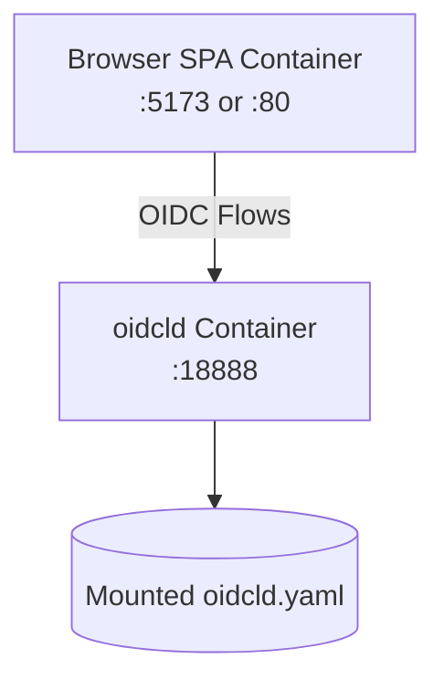

# OpenID Connect for Local Development: OIDCLD

A fake OpenID Connect Identity Provider (IdP) designed for testing and development purposes.


## Terminology

This project uses terminology from xUnit test patterns to clearly describe its purpose and functionality:

### **Fake vs Mock**
- **Fake**: A working implementation with simplified behavior, suitable for testing. Fakes have real business logic but take shortcuts (e.g., in-memory storage instead of a database).
- **Mock**: An object that verifies behavior by recording interactions and asserting expectations.

### **This Project is a "Fake"**
This OpenID Connect Identity Provider is a **fake** implementation because it:
- Provides a fully functional OpenID Connect server with real protocol compliance
- Uses simplified implementations (in-memory storage, test certificates, user selection UI)
- Enables actual authentication flows for testing purposes
- Does not verify specific interactions or assert expectations like a mock would

The term "fake" accurately describes this tool's role in testing scenarios - it's a real, working identity provider designed specifically for development and testing environments.

----


**Login Screen:** No password, just click to login. It helps you to test. No special no-login-local-dev-only-logic anymore.

----

## Primary Function
- **OpenID Connect ID provider for local test environment** (❌ NEVER USE IT ON PROD ENV)
  - **Multiple Flow Support**: Authorization Code Flow, Client Credentials Flow, Device Flow, and Refresh Token Flow
  - **PKCE Support**: Proof Key for Code Exchange implementation for enhanced security
  - **Refresh Token Support**: Optional refresh token generation and validation for long-lived sessions
  - **End Session Support**: OpenID Connect RP-Initiated Logout with configurable discovery visibility
  - **OpenID Discovery**: Standards-compliant `/.well-known/openid-configuration` endpoint
- **Best for Local Testing**
  - **Working Well with Docker**: No storage like database required. Just work with single config file.
  - **Fast Login**: Just click user name. No password.
  - **Custom JWT Claims**: YAML configuration supports additional information in JWT tokens
- **EntraID/AzureAD Compatibility**:
  - **Test with MSAL.js**

## Use Cases

There are two launch style (single binary, container) and two API modes (OpenID Connect, EntraID compatible).

### 1. Simple Local Server and Standard OpenID Connect

Use the compiled `oidcld` binary directly on your workstation. Fastest iteration, minimal moving parts.

```mermaid
flowchart TB
  DevApp[Local App (React/Vite, Go, Node, etc)] -->|Auth Code / Device / Client Credentials| OIDCLD[oidcld Binary\nhttp://localhost:18888]
  OIDCLD --> Config[(oidcld.yaml)]
  OIDCLD --> Users[In-Memory Users]
```

Key points:
- HTTP by default (port 18888)
- One YAML file (`oidcld.yaml`) + generated key pair
- Click-to-login user picker (no password)
- Great for quick prototyping & unit/integration tests

Quick start:
```bash
./oidcld init            # generate config + keys
./oidcld                 # start on http://localhost:18888
open http://localhost:18888/.well-known/openid-configuration
```

Add HTTPS later by generating certs (mkcert) and starting with `--cert-file/--key-file`.

**Option 1: Go Get Tool (Go 1.25+)**
```bash
go get -tool github.com/shibukawa/oidcld@latest
```

**Option 2: Download from GitHub Releases**
1. Visit the [GitHub releases page](https://github.com/shibukawa/oidcld/releases)
2. Download the appropriate binary for your operating system
3. Make the binary executable (on Unix-like systems): `chmod +x oidcld`

### 2. Docker Mode and Standard OpenID Connect

Run oidcld and your SPA/API in containers. Reproducible environment for teams & CI.

```bash
docker pull ghcr.io/shibukawa/oidcld
```



Key points:
- Share `oidcld.yaml` via bind mount or COPY for user definition (Other configuration values can be passed via environment variables)
- Health checks can gate dependent services
- Same flows as local mode; config reload watch still works if file is mounted

Example minimal compose service (excerpt):

```yaml
services:
  oidcld:
    image: ghcr.io/shibukawa/oidcld:latest
    ports:
      - "18888:18888"
    volumes:
      - ./oidcld.yaml:/app/oidcld.yaml:ro
    command: ["serve", "--config", "/app/oidcld.yaml"]
```

Usage:
```bash
./oidcld init                # create oidcld.yaml locally
docker compose up -d         # start stack
curl http://localhost:18888/health
```

### 3. EntraID Compatible Mode (MSAL / Azure-style claims)

Emulates Azure AD (EntraID) shape for local MSAL integration. Requires HTTPS + fragment response mode.

```mermaid
flowchart TB
  MSALApp[MSAL-enabled App\nHTTPS] -->|Auth Code + PKCE + fragment| OIDCLDEntra[oidcld (entraid-v2 template)\nhttps://localhost:18888]
  OIDCLDEntra --> Claims[Azure-like Claims\n(oid, tid, preferred_username, upn)]
  OIDCLDEntra --> ConfigEntra[(entraid-v2 template yaml)]
```

Key points:
- Use `./oidcld init --template entraid-v2 --mkcert` to scaffold
- Forces `nonce_required` and appropriate issuer format
- Provides Azure-style claim set (e.g. `oid`, `tid`, `preferred_username`)
- HTTPS mandatory for MSAL libraries

Quick start:
```bash
./oidcld init --template entraid-v2 --mkcert
./oidcld --cert-file localhost.pem --key-file localhost-key.pem
curl -k https://localhost:18888/.well-known/openid-configuration
```

Troubleshooting:
- MSAL error about insecure origins → ensure HTTPS + trusted cert (mkcert install)
- Missing refresh token → include `offline_access` scope & enable refresh in config

#### HTTPS Configuration

MSAL libraries require HTTPS for security. There are two options to configure OIDCLD with HTTPS support:


**Option 1: Use certification files**

You can use mkcert to create certification:

```bash
# Generate certificates with mkcert
brew install mkcert  # macOS
mkcert -install
mkcert localhost 127.0.0.1 ::1

# Start OIDCLD with HTTPS
./oidcld --cert-file localhost.pem --key-file localhost-key.pem
```

**Option 2: Use ACME Protocol server**

OIDCLD also supports ACME protocol to obtain certification file automatically. The following sample is using local ACME server. 

```yaml:compose.yaml
services:
  # myencrypt - Local ACME server for development
  myencrypt.localhost:
    image: ghcr.io/shibukawa/myencrypt:latest
    ports:
      - "14000:80"  # ACME server port
    environment:
      - MYENCRYPT_EXPOSE_PORT=14000  # Required: Host-accessible port
      - MYENCRYPT_PROJECT_NAME=oidcld  # Required: Project name for Docker mode
      - MYENCRYPT_HOSTNAME=myencrypt.localhost  # Required: Hostname for ACME directory URLs
      - MYENCRYPT_INDIVIDUAL_CERT_TTL=168h  # 7 days (7 * 24h)
      - MYENCRYPT_CA_CERT_TTL=19200h
      - MYENCRYPT_ALLOWED_DOMAINS=localhost,*.localhost
      - MYENCRYPT_CERT_STORE_PATH=/data
      - MYENCRYPT_DATABASE_PATH=/data/myencrypt.db
      - MYENCRYPT_LOG_LEVEL=info  # Enable debug logging
    volumes:
      - myencrypt-data:/data
    restart: unless-stopped
  # OIDCLD with myencrypt autocert (TLS-ALPN challenge)
  oidc.localhost:
    # image: oidcld:local
    build: .
    # image: ghcr.io/shibukawa/oidcld:latest
    ports:
      - "8443:443"     # HTTPS OIDC server port (mapped to non-privileged port)
    volumes:
      - ./examples/autocert/config/oidcld.yaml:/app/config.yaml:ro
    environment:
      - OIDCLD_CONFIG=/app/config.yaml
      # Minimal autocert environment variables (TLS-ALPN challenge)
      - OIDCLD_ACME_DOMAIN=oidc.localhost
      - OIDCLD_ACME_DIRECTORY_URL=http://myencrypt.localhost/acme/directory
      - OIDCLD_ACME_CACHE_DIR=/tmp/autocert-cache  # Temporary cache directory (no persistence)
      - OIDCLD_ACME_EMAIL=dev@localhost
      - OIDCLD_ACME_AGREE_TOS=true
      - OIDCLD_ACME_INSECURE_SKIP_VERIFY=true
      - OIDCLD_ACME_RENEWAL_THRESHOLD=1
    command: ["serve", "--config", "/app/config.yaml", "--port", "443"]
    depends_on:
      myencrypt.localhost:
        condition: service_healthy
    restart: unless-stopped
```


#### MSAL Configuration for OIDCLD

```typescript
import { PublicClientApplication } from '@azure/msal-browser';

const msalConfig = {
  auth: {
    clientId: 'your-azure-app-id',
    authority: 'https://localhost:18888',  // HTTPS required
    redirectUri: 'https://localhost:3000/callback',
    postLogoutRedirectUri: 'https://localhost:3000/'
  },
  cache: {
    cacheLocation: 'localStorage',
    storeAuthStateInCookie: false,
  }
};

const msalInstance = new PublicClientApplication(msalConfig);

// Login request
const loginRequest = {
  scopes: ['openid', 'profile', 'email'],
  extraScopesToConsent: ['offline_access']  // For refresh tokens
};
```

## License

This project is licensed under the GNU Affero General Public License v3.0 (AGPL-3.0).
