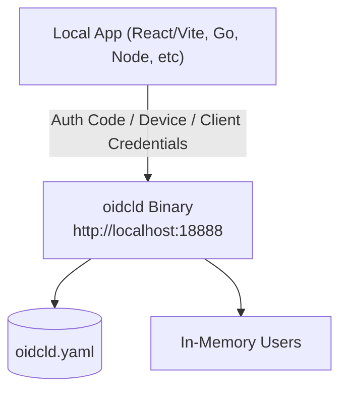
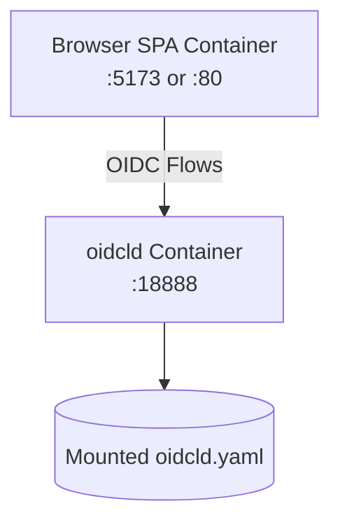
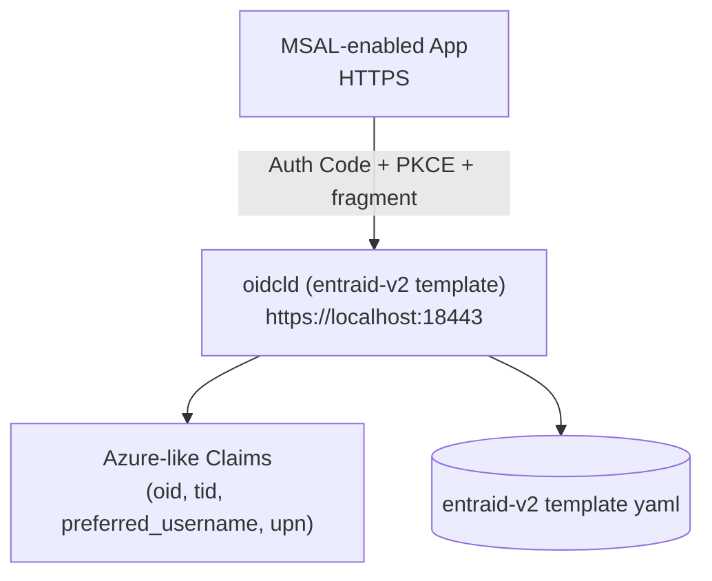

# OpenID Connect for Local Development: OIDCLD

A fake OpenID Connect Identity Provider (IdP) designed for testing and development purposes.

[](https://github.com/shibukawa/oidcld/actions/workflows/ci.yml)
[](https://github.com/shibukawa/oidcld/releases)
[](go.mod)
[](LICENSE.md)
[](https://github.com/shibukawa/oidcld/pkgs/container/oidcld)

Japanese: see [README.ja.md](README.ja.md)

Quick links: [llms.txt](llms.txt) | [Configuration Guide](docs/config.md)

## Table of Contents
- [Terminology](#terminology)
- [Primary Function](#primary-function)
- [Use Cases](#use-cases)
- [3. EntraID Compatible Mode (MSAL / Azure-style claims)](#3-entraid-compatible-mode-msal--azure-style-claims)
- [HTTPS Configuration](#https-configuration)
- [MSAL Configuration for OIDCLD](#msal-configuration-for-oidcld)
- [CLI Summary](#cli-summary)
- [Security Limitations](#security-limitations)
- [Documentation](#documentation)
- [License](#license)


## Terminology

This project uses terminology from xUnit test patterns to clearly describe its purpose and functionality:

### **Fake vs Mock**
- **Fake**: A working implementation with simplified behavior, suitable for testing. Fakes have real business logic but take shortcuts (e.g., in-memory storage instead of a database).
- **Mock**: An object that verifies behavior by recording interactions and asserting expectations.

### **This Project is a "Fake"**
This OpenID Connect Identity Provider is a **fake** implementation because it:
- Provides a fully functional OpenID Connect server with real protocol compliance
- Uses simplified implementations (in-memory storage, test certificates, user selection UI)
- Enables actual authentication flows for testing purposes
- Does not verify specific interactions or assert expectations like a mock would

The term "fake" accurately describes this tool's role in testing scenarios - it's a real, working identity provider designed specifically for development and testing environments.

----


**Login Screen:** No password—just click to log in. Helps testing. No more dev-only login bypasses.

You can also mark each environment on `/login` with a title, a color, and a Markdown note:

```yaml
oidc:
  login_ui:
    env_title: "Staging"
    info_markdown_file: "./docs/login-links.staging.md"
```

----

## Primary Function
- **OpenID Connect ID provider for local test environment** (❌ NEVER USE IT ON PROD ENV)
  - **Multiple Flow Support**: Authorization Code Flow, Client Credentials Flow, Device Flow, and Refresh Token Flow
  - **PKCE Support**: Proof Key for Code Exchange implementation for enhanced security
  - **Refresh Token Support**: Optional refresh token generation and validation for long-lived sessions
  - **End Session Support**: OpenID Connect RP-Initiated Logout with configurable discovery visibility
  - **OpenID Discovery**: Standards-compliant `/.well-known/openid-configuration` endpoint
- **Best for Local Testing**
  - **Works well with Docker**: No database required; single config file.
  - **Fast login**: Just click a user name; no password.
  - **Custom JWT Claims**: YAML configuration supports additional information in JWT tokens
- **EntraID/AzureAD Compatibility**:
  - **Test with MSAL.js**

## Use Cases

There are two launch styles (single binary, container) and two API modes (OpenID Connect, EntraID compatible).

### 1. Simple Local Server and Standard OpenID Connect

Use the compiled `oidcld` binary directly on your workstation. Fastest iteration, minimal moving parts.


```mermaid
flowchart TB
  DevApp["Local App (React/Vite, Go, Node, etc)"] -->|Auth Code / Device / Client Credentials| OIDCLD[oidcld Binary<br/>http://localhost:18888]
  OIDCLD --> Config[(oidcld.yaml)]
  OIDCLD --> Users[In-Memory Users]
```

Key points:
- HTTP by default (port 18888)
- One YAML file (`oidcld.yaml`) + generated key pair
- Click-to-login user picker (no password)
- Great for quick prototyping & unit/integration tests

Quick start:
```bash
./oidcld init            # generate config + keys
./oidcld                 # start on http://localhost:18888
open http://localhost:18888/.well-known/openid-configuration
```

Add HTTPS later by generating certs (mkcert) and starting with `--cert-file/--key-file`.

For the managed local-development path, configure `certificate_authority` and `console` in [oidcld.yaml](oidcld.yaml). OIDCLD exposes the Developer Console on `http://127.0.0.1:18889/console/`, issues a local root CA under the configured `ca_dir`, and provides download endpoints for the root certificate plus install / uninstall scripts.

For local frontend work, use the VS Code `dev` task. It starts the backend with the usual `serve` flow and runs the Vite dev server with `/console/api/*` proxied to the Developer Console listener, so Vue changes are reflected immediately. For release-style builds, use the `build` task to build `web/admin`, sync the generated files into the backend embed directory, and then compile the Go binary.

**Option 1: Go install (Go 1.24+)**
```bash
go install github.com/shibukawa/oidcld@latest
```
Make sure `$GOBIN` is on your `PATH`.

**Option 2: Download from GitHub Releases**
1. Visit the [GitHub releases page](https://github.com/shibukawa/oidcld/releases)
2. Download the appropriate binary archive for your operating system/architecture
3. Make the binary executable (on Unix-like systems): `chmod +x oidcld`

Current release binary targets:
- `oidcld-linux-amd64.tar.gz`
- `oidcld-linux-arm64.tar.gz`
- `oidcld-darwin-arm64.tar.gz`
- `oidcld-windows-amd64.zip`
- `oidcld-windows-arm64.zip`

Checksum verification:
```bash
# Example for Linux AMD64 archive
archive="oidcld-linux-amd64.tar.gz"
curl -fsSL "https://github.com/shibukawa/oidcld/releases/latest/download/${archive}" -o "${archive}"
curl -fsSL "https://github.com/shibukawa/oidcld/releases/latest/download/SHA256SUMS.txt" -o SHA256SUMS.txt
grep " ${archive}$" SHA256SUMS.txt | sha256sum -c -
```

macOS Gatekeeper note (for downloaded binaries):
```bash
chmod +x oidcld
xattr -l ./oidcld
xattr -d com.apple.quarantine ./oidcld
```

Use from GitHub Actions (latest release):

```yaml
- name: Download oidcld (Linux/macOS)
  if: runner.os != 'Windows'
  shell: bash
  run: |
    set -euo pipefail
    case "${RUNNER_OS}-${RUNNER_ARCH}" in
      Linux-X64)   archive="oidcld-linux-amd64.tar.gz" ;;
      Linux-ARM64) archive="oidcld-linux-arm64.tar.gz" ;;
      macOS-ARM64) archive="oidcld-darwin-arm64.tar.gz" ;;
      *) echo "unsupported runner: ${RUNNER_OS}-${RUNNER_ARCH}"; exit 1 ;;
    esac
    curl -fsSL "https://github.com/shibukawa/oidcld/releases/latest/download/${archive}" -o "${archive}"
    tar -xzf "${archive}"
    chmod +x oidcld
    echo "${PWD}" >> "${GITHUB_PATH}"

- name: Download oidcld (Windows)
  if: runner.os == 'Windows'
  shell: pwsh
  run: |
    switch ("$env:RUNNER_ARCH") {
      "X64" { $archive = "oidcld-windows-amd64.zip" }
      "ARM64" { $archive = "oidcld-windows-arm64.zip" }
      default { throw "unsupported runner architecture: $env:RUNNER_ARCH" }
    }
    Invoke-WebRequest -Uri "https://github.com/shibukawa/oidcld/releases/latest/download/$archive" -OutFile $archive
    Expand-Archive -Path $archive -DestinationPath . -Force
    Add-Content -Path $env:GITHUB_PATH -Value $PWD
```

After these steps, run `oidcld --help` (Unix) or `./oidcld.exe --help` (Windows).

### 2. Docker Mode and Standard OpenID Connect

Run oidcld and your SPA/API in containers. Reproducible environment for teams & CI.

```bash
docker pull ghcr.io/shibukawa/oidcld
```


```mermaid
flowchart TB
  Browser[Browser SPA Container<br/>:5173 or :80] -->|OIDC Flows| OIDCLDContainer[oidcld Container<br/>:18888]
  OIDCLDContainer --> Volume[(Mounted oidcld.yaml)]
```

Key points:
- Share `oidcld.yaml` via bind mount or COPY for user definition (Other configuration values can be passed via environment variables)
- Health checks can gate dependent services
- Same flows as local mode; config reload watch still works if file is mounted

Example minimal compose service (excerpt):

```yaml
services:
  oidcld:
    image: ghcr.io/shibukawa/oidcld:latest
    ports:
      - "18888:18888"
    volumes:
      - ./oidcld.yaml:/app/oidcld.yaml:ro
    command: ["serve", "--config", "/app/oidcld.yaml"]
```

Usage:
```bash
./oidcld init                # create oidcld.yaml locally
docker compose up -d         # start stack
curl http://localhost:18888/health
```

### 3. EntraID Compatible Mode (MSAL / Azure-style claims)

Emulates Azure AD (EntraID) shape for local MSAL integration. Requires HTTPS + fragment response mode.


```mermaid
flowchart TB
  MSALApp[MSAL-enabled App<br/>HTTPS] -->|Auth Code + PKCE + fragment| OIDCLDEntra["oidcld (entraid-v2 template)<br/>https://localhost:18443"]
  OIDCLDEntra --> Claims["Azure-like Claims<br/>(oid, tid, preferred_username, upn)"]
  OIDCLDEntra --> ConfigEntra[(entraid-v2 template yaml)]
```

Key points:
- Use `./oidcld init --template entraid-v2` to scaffold
- Forces `nonce_required` and appropriate issuer format
- Provides Azure-style claim set (e.g. `oid`, `tid`, `preferred_username`)
- Defaults single-audience `aud` claims to a string for closer EntraID compatibility; set `oidcld.aud_claim_format: array` if you need array output
- Serves Microsoft-style v2 discovery and endpoint aliases such as `/{tenant}/v2.0/.well-known/openid-configuration` and `/{tenant}/oauth2/v2.0/authorize`
- Accepts EntraID v2 tenant aliases `common`, `organizations`, `customers`, and `contoso.onmicrosoft.com`, and also accepts tenantless v2 paths such as `/v2.0/.well-known/openid-configuration`
- The same alias-tenant and tenantless behavior is also available in EntraID v1 mode, using the v1 path shape without the `v2.0` segment
- Startup logs compact EntraID endpoint output with `{tenant}` placeholders, tenantless requests emit warnings, and `/health` requests stay out of access logs
- HTTPS mandatory for MSAL libraries

Quick start:
```bash
./oidcld init --template entraid-v2
./oidcld --cert-file localhost.pem --key-file localhost-key.pem
curl -k https://localhost:18443/.well-known/openid-configuration
```

Troubleshooting:
- `oidcld init` finishes but no `oidcld.yaml` is created (v0.1.2 only) → upgrade to a newer release; as a workaround run non-interactive mode: `oidcld init oidcld.yaml --template standard`
- MSAL error about insecure origins → ensure HTTPS + trusted cert (mkcert install)
- Missing refresh token → include `offline_access` scope & enable refresh in config
- Need Azure-style single-string `aud` output across all flows → keep the default `oidcld.aud_claim_format: string`; switch to `array` only when a client explicitly expects JSON array output

## CLI Summary

Commands for local development and testing. MCP is intentionally omitted here.

- `oidcld init`: Initialize configuration from a template
  - Flags: `--template standard|entraid-v1|entraid-v2`, `--tenant-id`, `--https`, `--autocert`, `--acme-server`, `--domains`, `--email`, `--port`, `--issuer`, `--overwrite`

- `oidcld serve`: Start the OpenID Connect server
  - Flags: `--config oidcld.yaml`, `--port`, `--http-readonly-port`, `--watch`, `--cert-file`, `--key-file`, `--verbose`
  - Notes: HTTP defaults to port `18888`. HTTPS defaults to port `18443`. In HTTPS mode, `--http-readonly-port` defaults to `18888` for discovery/JWKS/health only. `serve` listeners also enable the local access filter by default: requests without `Forwarded`/`X-Forwarded-For` must come from loopback or local private space (`127.0.0.0/8`, `::1`, `fc00::/7`, `10/8`, `172.16/12`, `192.168/16`), and forwarded requests are rejected unless `oidcld.access_filter.max_forwarded_hops` is raised from its default `0`. When `--port` is specified and the issuer host is local (`localhost`/loopback), the issuer port is synchronized to the same port.

- `oidcld health`: Probe server health
  - Flags: `--url`, `--port`, `--config`, `--timeout`
  - Notes: If `--url` is omitted, it auto-detects from config. In container setups with `OIDCLD_CONFIG`, it dials localhost and skips TLS verification for self-signed certs.

## Security Limitations

This project is for development/testing only. Do not use in production.

- Accepts any `client_id`: There is no client registration or allowlist.
- Redirect URIs are not whitelisted: The requested `redirect_uri` is permitted dynamically for development convenience.
- Client secrets are not required/enforced: Suitable only for local testing.
- Ephemeral signing keys: RSA keys are generated on startup and not persisted; tokens from previous runs will not validate after restart.
- Local-only defaults: `serve` blocks non-local peers and any request carrying `Forwarded` / `X-Forwarded-For` unless you loosen `oidcld.access_filter`.
- Permissive CORS/discovery defaults: CORS and discovery are configured to ease local SPA development; narrow them in config if needed.

These trade-offs are deliberate to maximize developer ergonomics in local environments.

## Documentation

Extended docs (kept out of this top-level README for brevity):

- AI-oriented repository summary: [llms.txt](llms.txt)
- Configuration Guide: [docs/config.md](docs/config.md)
- Other OAuth/OIDC Flows: [docs/otherflows.md](docs/otherflows.md)

See examples under `examples/` for concrete integration setups (React/MSAL, Vue, device/client credentials, autocert, etc.).

#### HTTPS Configuration

MSAL libraries require HTTPS for security. There are two options to configure OIDCLD with HTTPS support:


**Option 1: Use certificate files**

You can use mkcert to create certificates:

```bash
# Generate certificates with mkcert
brew install mkcert  # macOS
mkcert -install
mkcert localhost 127.0.0.1 ::1

# Start OIDCLD with HTTPS
./oidcld --cert-file localhost.pem --key-file localhost-key.pem
```

When HTTPS is active, oidcld also keeps discovery, JWKS, and health reachable on a restricted HTTP companion listener. The default HTTPS port is `18443`, and the companion HTTP port defaults to `18888`. Set `--http-readonly-port off` to disable it. The same `oidcld.access_filter` rules apply to both the HTTPS listener and the HTTP metadata companion.

**Option 2: Use managed self-signed TLS in Docker Compose**

The following sample uses OIDCLD's managed development CA and persists it in a Docker volume so the same root CA and key material are reused across restarts until the volume is removed.

```yaml:compose.yaml
services:
  oidc.localhost:
    # image: oidcld:local
    build: .
    # image: ghcr.io/shibukawa/oidcld:latest
    ports:
      - "8443:443"     # HTTPS OIDC server port
      - "18889:18889"  # Developer Console + HTTP metadata companion
    volumes:
      - ./examples/autocert/config:/app/config:ro
      - oidcld-managed-ca:/app/tls
    environment:
      - OIDCLD_CONFIG=/app/config/oidcld.yaml
    command: ["serve", "--config", "/app/config/oidcld.yaml", "--port", "443"]
    healthcheck:
      test: ["CMD", "/usr/local/bin/oidcld", "health", "--url", "http://localhost:18889"]
      interval: 30s
      timeout: 10s
      start_period: 5s
      retries: 3
    restart: unless-stopped

  app.localhost:
    build:
      context: ./examples/azure-msal-browser-react
      dockerfile: Dockerfile
      args:
        VITE_OIDC_AUTHORITY: "https://oidc.localhost:8443"
        VITE_OIDC_CLIENT_ID: "test-client-id"
        VITE_OIDC_REDIRECT_URI: "http://app.localhost:3000/redirect"
        VITE_OIDC_POST_LOGOUT_REDIRECT_URI: "http://app.localhost:3000/"
        VITE_OIDC_SCOPES: "openid,profile,email,offline_access,User.Read"
    ports:
      - "3000:80"
    depends_on:
      oidc.localhost:
        condition: service_healthy
    restart: unless-stopped

volumes:
  oidcld-managed-ca:
```

With this sample, logging out from the React app returns to `http://app.localhost:3000/`. If the provider lands on the logout success page first, oidcld now shows a short success message and automatically redirects back after a few seconds. The root CA can be downloaded from `http://localhost:18889/console/` and remains stable while the `oidcld-managed-ca` volume exists.


#### MSAL Configuration for OIDCLD

```typescript
import { PublicClientApplication } from '@azure/msal-browser';

const msalConfig = {
  auth: {
    clientId: 'your-azure-app-id',
    authority: 'https://localhost:18443',  // HTTPS required
    redirectUri: 'https://localhost:3000/callback',
    postLogoutRedirectUri: 'https://localhost:3000/'
  },
  cache: {
    cacheLocation: 'localStorage',
    storeAuthStateInCookie: false,
  }
};

const msalInstance = new PublicClientApplication(msalConfig);

// Login request
const loginRequest = {
  scopes: ['openid', 'profile', 'email'],
  extraScopesToConsent: ['offline_access']  // For refresh tokens
};
```

## License

This project is licensed under the GNU Affero General Public License v3.0 (AGPL-3.0).
