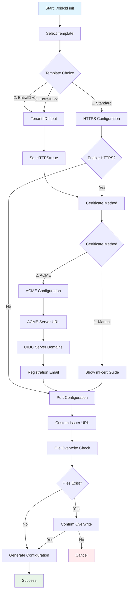

## Configuration Guide

Authoritative reference for all runtime and initialization settings. The root README intentionally stays concise.

## Quick Start

```bash
./oidcld init                        # Interactive wizard
./oidcld init --template entraid-v2  # Non-interactive with template
./oidcld --watch                     # Live reload mode
./oidcld                             # Start server (default: HTTP on port 18888)
```

## Configuration File Structure

### Files
| File | Purpose |
|------|---------|
| oidcld.yaml | Main configuration file |
| localhost.pem / localhost-key.pem | TLS certificates (mkcert/manual) |

### Core Configuration Sections

#### 1. OIDC Identity Provider Settings (`oidcld`)

```yaml
oidcld:
  iss: "http://localhost:18888"               # Issuer URL (default varies by mode)
  pkce_required: false                        # Require PKCE (default: false)
  nonce_required: false                       # Require nonce (default: false)
  expired_in: 3600                           # Token expiration in seconds (default: 3600)
  valid_scopes:                              # Custom scopes (default: [admin, read, write])
    - "admin"
    - "read" 
    - "write"
  refresh_token_enabled: true                # Enable refresh tokens (default: true)
  refresh_token_expiry: 86400               # Refresh token TTL in seconds (default: 86400)
  end_session_enabled: true                 # Enable logout endpoint (default: true)
  end_session_endpoint_visible: true        # Show in discovery (default: true)
  verbose_logging: false                    # Verbose logging (default: false)
  tls_cert_file: ""                         # TLS certificate file path (optional)
  tls_key_file: ""                          # TLS key file path (optional)
```

**Notes:**
- Standard OIDC scopes (`openid`, `profile`, `email`, `offline_access`, `address`, `phone`) are automatically included
- For EntraID modes, `address` and `phone` scopes are excluded
- RSA-2048 signing keys are generated in memory at startup

#### 2. EntraID/AzureAD Compatibility (`entraid`)

```yaml
entraid:
  tenant_id: "12345678-1234-1234-1234-123456789abc"  # Azure tenant ID
  version: "v2"                                      # v1 or v2
```

**Defaults by mode:**
- **EntraID v1**: `tenant_id: "common"`, `version: "v1"`
- **EntraID v2**: `tenant_id: "12345678-1234-1234-1234-123456789abc"`, `version: "v2"`

#### 3. CORS Settings (`cors`)

```yaml
cors:
  enabled: true                           # Enable CORS (default: true)
  allowed_origins:                        # Allowed origins (default: permissive *)
    - "http://localhost:3000"
    - "http://localhost:5173"
  allowed_methods:                        # HTTP methods (default: [GET, POST, OPTIONS])
    - "GET"
    - "POST"
    - "OPTIONS"
  allowed_headers:                        # Headers (default: [Content-Type, Authorization, Accept])
    - "Content-Type"
    - "Authorization"
    - "Accept"
```

#### 4. Automatic HTTPS Certificates (`autocert`)

The internal YAML field names match the generated template. (Note: the field is `acme_server`, not `acme_directory_url`). Only a subset is exposed via the init wizard; advanced fields can be added manually.

```yaml
autocert:
  enabled: true                 # Enable autocert (default: false)
  domains:                      # Required (>=1) when enabled
    - "localhost"
  email: "admin@example.com"    # Required
  agree_tos: true               # Must be true when enabled
  cache_dir: "./autocert-cache" # Default if omitted (wizard may set /tmp/autocert)
  acme_server: "http://localhost:14000"  # Custom ACME directory URL
  staging: false                # If true and acme_server empty, uses Let's Encrypt staging
  renewal_threshold: 1          # Days before expiry to attempt renewal (default 1)
  challenge:                    # Optional (HTTP-01/TLS-ALPN abstraction)
    port: 80
    path: "/.well-known/acme-challenge/"
    timeout: "30s"
  rate_limit:                   # Optional limiter for ACME traffic
    requests_per_second: 10
    burst: 20
  retry:                        # Optional retry backoff for ACME operations
    max_attempts: 3
    initial_delay: "1s"
    max_delay: "30s"
```

Not shown in the generated template (but supported internally):
- `insecure_skip_verify` (bool) – can be toggled via environment overrides (used mainly for local/dev ACME servers); settable only through env at present.

#### 5. User Definitions (`users`)

```yaml
users:
  admin:
    display_name: "Administrator"
    extra_valid_scopes:                   # Additional scopes for this user
      - "admin"
      - "read"
      - "write"
    extra_claims:                         # Additional JWT claims
      email: "admin@example.com"
      role: "admin"
      given_name: "Admin"
      family_name: "User"
      department: "IT"
```

**Default Users:**
- `admin`: Administrator with full access
- `user`: Regular user with read access
- `manager`: Project manager with read/write access
- `developer`: Software developer with read/write access
- `analyst`: Data analyst with read access
- `guest`: Guest user with basic access

**EntraID Additional Claims (auto-injected in EntraID templates):**
When using EntraID templates, users automatically include:
- `oid`: Object ID (unique identifier)
- `tid`: Tenant ID
- `preferred_username`: EntraID username
- `upn`: User Principal Name
- `roles`: EntraID roles array
- `groups`: Groups array
- `app_displayname`: Application display name

## Command-Line Flags

| Flag | Description | Default |
|------|-------------|---------|
| `--config` | Configuration file path | oidcld.yaml |
| `--port` | Server listen port | 18888 |
| `--watch` | Enable live reload | false |
| `--cert-file` | TLS certificate file | - |
| `--key-file` | TLS key file | - |
| `--verbose` | Verbose logging | false |

## Environment Variables

### Server Configuration
| Environment Variable | Description | Default |
|---------------------|-------------|---------|
| `PORT` | Override server port | 18888 |

### ACME/Autocert Overrides
Environment overrides auto-enable autocert even if the file sets `enabled: false` (useful in container deployments). Only the following variables are currently parsed:

| Environment Variable | Description | Notes |
|----------------------|-------------|-------|
| `OIDCLD_ACME_DIRECTORY_URL` | ACME directory (acme_server) URL | e.g. local dev CA or Let's Encrypt directory |
| `OIDCLD_ACME_EMAIL` | ACME registration email | Required when enabling |
| `OIDCLD_ACME_DOMAIN` | Comma-separated domain list | Overrides `domains` entirely |
| `OIDCLD_ACME_CACHE_DIR` | Cache directory | Defaults to `/tmp/autocert` if unset when env overrides present |
| `OIDCLD_ACME_AGREE_TOS` | Accept TOS (`true` / `false`) | Must be true to pass validation |

### Example Client Environment (Device Flow)
| Environment Variable | Default | Description |
|---------------------|---------|-------------|
| `OIDC_ISSUER` | `http://localhost:18888` | Target OIDC issuer URL |
| `OIDC_CLIENT_ID` | `device-flow-cli` | Client identifier |
| `OIDC_SCOPE` | `openid profile email` | Requested scopes |

## Runtime Behavior

### Live Reload
The `--watch` mode re-reads the YAML on change. Practical impact by category:

Reloads apply immediately (no restart):
- Users (add/remove/claims)
- `valid_scopes` (merged with standard scopes on reload)
- `expired_in`
- `pkce_required`, `nonce_required`
- Refresh token toggles (`refresh_token_enabled`, `refresh_token_expiry`)
- CORS section

Require restart (process-level constructs or TLS listener changes):
- Issuer (`iss`) (affects discovery consistency)
- Port (listener binding)
- TLS file paths / autocert enablement (certificate manager life-cycle)
- EntraID mode / tenant (affects claim injection logic & discovery)
- Autocert structural fields (`domains`, `acme_server`, rate limits, challenge, retry)

### HTTPS Modes
| Mode | Use Case | Setup |
|------|----------|-------|
| HTTP | Fast local iteration | Default (issuer `http://localhost:18888`) |
| Manual HTTPS | Test SPA with secure origin | Provide `--cert-file` / `--key-file` |
| mkcert | Trust local certs across browsers | Generate + use manual HTTPS method |
| ACME (auto) | End-to-end TLS lifecycle simulation | Configure `autocert` or env overrides |

### MCP (Model Context Protocol) Mode
```bash
./oidcld mcp              # stdio mode
./oidcld mcp --port 3001  # HTTP mode
```

## Initialization Wizard

The interactive wizard (`./oidcld init`) guides you through configuration setup:



### Wizard Questions Flow

1. **Template Selection**
   - Standard OpenID Connect (default)
   - EntraID/AzureAD v1.0
   - EntraID/AzureAD v2.0

2. **EntraID Configuration** (if EntraID template selected)
   - Tenant ID (optional)
   - HTTPS automatically enabled

3. **HTTPS Configuration** (Standard template only)
   - Enable HTTPS? [y/N]

4. **Certificate Method** (if HTTPS enabled)
   - Manual certificates (with mkcert guidance)
   - ACME (Let's Encrypt's protocol)

5. **ACME Details** (if ACME selected)
  - ACME server URL (`acme_server`) [http://localhost:14000]
   - OIDC server domains for certificates [localhost]
   - Email for ACME registration [admin@localhost]

6. **Server Configuration** (Standard template only)
   - Port number [18888]

7. **Advanced Options**
   - Custom issuer URL (optional)

8. **File Management**
   - Overwrite existing files confirmation

## Troubleshooting

| Symptom | Possible Cause | Solution |
|---------|---------------|----------|
| 401 after authentication | Redirect URI mismatch or invalid scope | Check redirect URI and requested scopes |
| CORS blocked | Origin not in allowed list | Add origin to `cors.allowed_origins` |
| MSAL rejects connection | HTTPS required or untrusted certificate | Use HTTPS with trusted certificate |
| No refresh_token returned | Missing scope or disabled | Add `offline_access` scope and enable refresh tokens |
| Certificate errors | Invalid or expired certificates | Regenerate certificates or check file paths |

## Examples

### Basic HTTP Setup
```bash
./oidcld init
# Select: 1 (Standard)
# HTTPS: N
# Port: (default 18888)
./oidcld
```

### HTTPS with mkcert
```bash
# Install mkcert
brew install mkcert
mkcert -install

# Initialize with HTTPS
./oidcld init
# Select: 1 (Standard)
# HTTPS: y
# Certificate: 1 (Manual)

# Generate certificates
mkcert localhost

# Start server
./oidcld --cert-file localhost.pem --key-file localhost-key.pem
```

### EntraID v2 Template
```bash
./oidcld init --template entraid-v2
# Or interactively: select 3 (EntraID v2.0)
```

For protocol flow specifics, see `otherflows.md`.