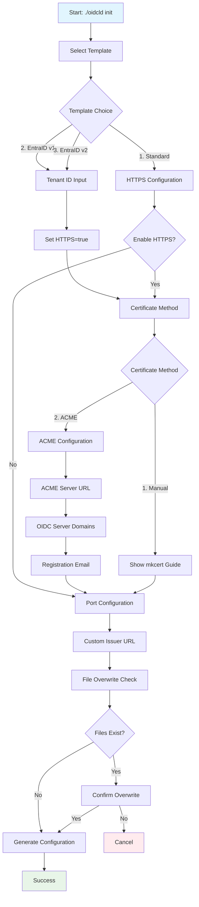

## Configuration Guide

Authoritative reference for all runtime and initialization settings. The root README intentionally stays concise.

## Quick Start

```bash
./oidcld init                        # Interactive wizard
./oidcld init --template entraid-v2  # Non-interactive with template
./oidcld --watch                     # Live reload mode
./oidcld                             # Start server (default: HTTP on port 8080, HTTPS on 8443)
```

## Configuration File Structure

### Files
| File | Purpose |
|------|---------|
| oidcld.yaml | Main configuration file |
| localhost.pem / localhost-key.pem | TLS certificates (mkcert/manual) |

### Core Configuration Sections

#### 1. OIDC Identity Provider Settings (`oidc`)

```yaml
oidc:
  iss: "http://localhost:8080"                # Issuer URL (default varies by mode)
  pkce_required: false                        # Require PKCE (default: false)
  nonce_required: false                       # Require nonce (default: false)
  expired_in: 3600                           # Token expiration in seconds (default: 3600)
  aud_claim_format: "string"                # Single-audience aud: string or array (default: string)
  valid_scopes:                              # Custom scopes (default: [admin, read, write])
    - "admin"
    - "read" 
    - "write"
  access_filter:
    enabled: true                            # Restrict serve listeners to local peers by default
    extra_allowed_ips: []                    # Extra allowed peer IPs/CIDRs
    max_forwarded_hops: 0                    # Reject Forwarded/X-Forwarded-For by default
  login_ui:
    env_title: "Staging"                     # Optional label shown on /login only
    accent_color: "#D97A00"                  # Optional hex color; auto-generated from env_title when omitted
    info_markdown_file: "./docs/login-links.staging.md"  # Optional Markdown rendered on /login
  refresh_token_enabled: true                # Enable refresh tokens (default: true)
  refresh_token_expiry: 86400               # Refresh token TTL in seconds (default: 86400)
  end_session_enabled: true                 # Enable logout endpoint (default: true)
  end_session_endpoint_visible: true        # Show in discovery (default: true)
  verbose_logging: false                    # Verbose logging (default: false)
  tls_cert_file: ""                         # TLS certificate file path (optional)
  tls_key_file: ""                          # TLS key file path (optional)
  cors: true                                # Or object with origins/methods/headers
```

#### 2. Developer Console (`console`)

```yaml
console:
  bind_address: "127.0.0.1"               # Loopback by default
```

#### 3. Managed Development CA (`certificate_authority`)

```yaml
certificate_authority:
  ca_dir: "./tls"
  domains:
    - "localhost"
    - "*.dev.localhost"
  ca_cert_ttl: "87600h"
  leaf_cert_ttl: "720h"
```

**Notes:**
- Standard OIDC scopes (`openid`, `profile`, `email`, `offline_access`, `address`, `phone`) are automatically included
- For EntraID modes, `address` and `phone` scopes are excluded
- RSA-2048 signing keys are generated in memory at startup
- `aud_claim_format` controls how a single audience is serialized in JWTs. `string` matches common EntraID output, while `array` forces `aud` to stay a JSON array. Multiple audiences always remain arrays.
- `access_filter.enabled` defaults to `true` on the host. When the `access_filter` section is omitted and oidcld detects a container runtime, the runtime default becomes `false`. Explicit `access_filter` settings are still respected as written.
- Requests without `Forwarded`/`X-Forwarded-For` are allowed only from loopback or local private peers (`127.0.0.0/8`, `::1`, `fc00::/7`, `10/8`, `172.16/12`, `192.168/16`).
- `access_filter.extra_allowed_ips` accepts both single IPs and CIDRs. Single IPs are normalized internally to `/32` or `/128`.
- `access_filter.max_forwarded_hops` defaults to `0`, so requests carrying `Forwarded` or `X-Forwarded-For` are rejected unless you explicitly raise the limit.
- `login_ui.env_title` and `login_ui.info_markdown_file` affect the `/login` page only. Device verification and logout pages stay unchanged.
- `login_ui.accent_color` accepts only `#RRGGBB`. If omitted and `env_title` is set, oidcld generates a stable high-visibility color from the title.
- `login_ui.info_markdown_file` is resolved relative to the config file location. Markdown is re-read on each `/login` request, so edits show up without restarting.
- Discovery keeps `issuer` fixed to `oidc.iss`, but the public endpoint URLs it returns (`authorization_endpoint`, `token_endpoint`, `jwks_uri`, and related endpoints) follow the request host. This allows browser-facing and container-internal metadata access to coexist.

#### 4. EntraID/AzureAD Compatibility (`entraid`)

```yaml
entraid:
  tenant_id: "12345678-1234-1234-1234-123456789abc"  # Azure tenant ID
  version: "v2"                                      # v1 or v2
```

**Defaults by mode:**
- **EntraID v1**: `tenant_id: "common"`, `version: "v1"`
- **EntraID v2**: `tenant_id: "12345678-1234-1234-1234-123456789abc"`, `version: "v2"`

#### 5. OIDC CORS Settings (`oidc.cors`)

```yaml
oidc:
  cors:
    origins:
      - "http://localhost:3000"
      - "http://localhost:5173"
    methods:
      - "GET"
      - "POST"
      - "OPTIONS"
    headers:
      - "Content-Type"
      - "Authorization"
      - "Accept"
```

`cors: true` is shorthand for permissive browser-friendly defaults. The detailed object form supports `origins`, `methods`, and `headers`.

#### 6. Reverse Proxy / Edge Routing (`reverse_proxy`)

```yaml
reverse_proxy:
  log_retention: 200
  ignore_log_paths:
    - "/health"
  hosts:
    - host: "https://app.dev.localhost"
      routes:
        - path: "/api"
          target_url: "http://127.0.0.1:3000"
          gateway:
            required:
              scope: "read"
              aud: "demo-client"
            forward_claims_as_headers:
              sub: "X-OIDC-Sub"
              scope: "X-OIDC-Scope"
            replay_authorization: true
        - path: "/"
          static_dir: "./web/dist"
          spa_fallback: true
        - path: "/mock"
          openapi_file: "./openapi/mock.yaml"
          rewrite_path_prefix: "/"
          mock:
            prefer_examples: true
            default_status: "200"
            fallback_content_type: "application/json"
```

Notes:
- `hosts[]` acts as a Virtual Host table; omit `host` once to define a default virtual host fallback
- each route must define exactly one of `target_url`, `static_dir`, or `openapi_file`
- `spa_fallback` is valid only with `static_dir`
- `gateway.required: true` accepts any valid self-issued Bearer JWT; `gateway.required` can also be a claim map such as `scope` / `aud`
- `gateway` is valid on `target_url` and `openapi_file` routes and can replay OIDCLD-issued JWTs with refreshed signature and timestamps before proxying upstream
- `openapi_file` is resolved relative to the config file, loaded at startup, and validated with `kin-openapi`
- `mock.prefer_examples` prefers named / inline examples; schema synthesis is used only when examples are unavailable
- `oidcld serve --proxy-port <port>` or `PROXY_PORT` starts a dedicated browser-facing reverse-proxy listener; in that mode all explicit `reverse_proxy.hosts[].host` values must use the same scheme
- when split listener mode is enabled, any explicit port in `reverse_proxy.hosts[].host` must match the resolved proxy listener port after `--proxy-port` / `PROXY_PORT` precedence; portless hosts still act as fallbacks

#### 7. Automatic HTTPS Certificates (`autocert`)

The internal YAML field names match the generated template. (Note: the field is `acme_server`, not `acme_directory_url`). Only a subset is exposed via the init wizard; advanced fields can be added manually.

```yaml
autocert:
  enabled: true                 # Enable autocert (default: false)
  domains:                      # Required (>=1) when enabled
    - "localhost"
  email: "admin@example.com"    # Required
  agree_tos: true               # Must be true when enabled
  cache_dir: "./autocert-cache" # Default if omitted (wizard may set /tmp/autocert)
  acme_server: "http://localhost:14000"  # Custom ACME directory URL
  staging: false                # If true and acme_server empty, uses Let's Encrypt staging
  renewal_threshold: 1          # Days before expiry to attempt renewal (default 1)
  challenge:                    # Optional (HTTP-01/TLS-ALPN abstraction)
    port: 80
    path: "/.well-known/acme-challenge/"
    timeout: "30s"
  rate_limit:                   # Optional limiter for ACME traffic
    requests_per_second: 10
    burst: 20
  retry:                        # Optional retry backoff for ACME operations
    max_attempts: 3
    initial_delay: "1s"
    max_delay: "30s"
```

Not shown in the generated template (but supported internally):
- `insecure_skip_verify` (bool) – can be toggled via environment overrides (used mainly for local/dev ACME servers); settable only through env at present.

#### 8. User Definitions (`users`)

```yaml
users:
  admin:
    display_name: "Administrator"
    extra_valid_scopes:                   # Additional scopes for this user
      - "admin"
      - "read"
      - "write"
    extra_claims:                         # Additional JWT claims
      email: "admin@example.com"
      role: "admin"
      given_name: "Admin"
      family_name: "User"
      department: "IT"
```

**Default Users:**
- `admin`: Administrator with full access
- `user`: Regular user with read access
- `manager`: Project manager with read/write access
- `developer`: Software developer with read/write access
- `analyst`: Data analyst with read access
- `guest`: Guest user with basic access

**EntraID Additional Claims (auto-injected in EntraID templates):**
When using EntraID templates, users automatically include:
- `oid`: Object ID (unique identifier)
- `tid`: Tenant ID
- `preferred_username`: EntraID username
- `upn`: User Principal Name
- `roles`: EntraID roles array
- `groups`: Groups array
- `app_displayname`: Application display name

## Command-Line Flags

| Flag | Description | Default |
|------|-------------|---------|
| `--config` | Configuration file path | oidcld.yaml |
| `--port` | Main OIDC / shared listener port | Outside containers: 8080 for HTTP, 8443 for HTTPS. In containers: 80 for HTTP, 443 for HTTPS |
| `--console-port` | Developer Console / metadata companion listener port | 8888 |
| `--proxy-port` | Optional dedicated reverse proxy listener port | disabled; `PROXY_PORT` can also enable split mode |
| `--http-readonly-port` | Restricted HTTP metadata listener in HTTPS mode | 8080 |
| `--watch` | Enable live reload | false |
| `--cert-file` | TLS certificate file | - |
| `--key-file` | TLS key file | - |
| `--verbose` | Verbose logging | false |

## Environment Variables

### Server Configuration
| Environment Variable | Description | Current implementation status |
|---------------------|-------------|-------------------------------|
| `OIDCLD_VERBOSE` | Enable verbose serve logging | Implemented via `serve` command env binding |
| `OIDCLD_CONTAINER` | Explicitly mark the runtime as container or non-container | Overrides auto-detection for container-specific defaults such as listener ports and the implicit `access_filter` default |
| `OIDCLD_CONFIG` | Config path used by container/health workflows | Used by runtime conventions and health auto-detection |
| `PORT` | Main listener port override | Implemented; used after `--port` and before defaults |
| `CONSOLE_PORT` | Developer Console port override | Implemented; used after `--console-port` and before defaults |
| `PROXY_PORT` | Reverse proxy split-listener port override | Implemented; used after `--proxy-port`; when unset, reverse proxy shares the main listener |
| `OIDCLD_ENV_TITLE` | Override `oidcld.login_ui.env_title` | Shows an environment banner on `/login` |
| `OIDCLD_ENV_COLOR` | Override `oidcld.login_ui.accent_color` | Must be `#RRGGBB`; if omitted, color can still auto-generate from `env_title` |
| `OIDCLD_ENV_MARKDOWN_FILE` | Override `oidcld.login_ui.info_markdown_file` | Path is resolved relative to the config file when not absolute |

### ACME/Autocert Overrides
Environment overrides auto-enable autocert even if the file sets `enabled: false` (useful in container deployments). Only the following variables are currently parsed:

| Environment Variable | Description | Notes |
|----------------------|-------------|-------|
| `OIDCLD_ACME_DIRECTORY_URL` | ACME directory (acme_server) URL | e.g. local dev CA or Let's Encrypt directory |
| `OIDCLD_ACME_EMAIL` | ACME registration email | Required when enabling |
| `OIDCLD_ACME_DOMAIN` | Comma-separated domain list | Overrides `domains` entirely |
| `OIDCLD_ACME_CACHE_DIR` | Cache directory | Defaults to `/tmp/autocert` if unset when env overrides present |
| `OIDCLD_ACME_AGREE_TOS` | Accept TOS (`true` / `false`) | Must be true to pass validation |

### Values Shown In Compose But Not Currently Parsed

The repository's `compose.yaml` currently includes these values, but `internal/config.LoadConfig()` does not read them yet:

| Environment Variable | Status |
|----------------------|--------|
| `OIDCLD_ACME_INSECURE_SKIP_VERIFY` | Present in compose example only; currently non-effective in config loading |
| `OIDCLD_ACME_RENEWAL_THRESHOLD` | Present in compose example only; currently non-effective in config loading |

These should be treated as example drift unless the implementation is extended.

### Example Client Environment (Device Flow)
| Environment Variable | Default | Description |
|---------------------|---------|-------------|
| `OIDC_ISSUER` | `http://localhost:8080` | Target OIDC issuer URL |
| `OIDC_CLIENT_ID` | `device-flow-cli` | Client identifier |
| `OIDC_SCOPE` | `openid profile email` | Requested scopes |

## Runtime Behavior

### Live Reload
The `--watch` mode re-reads the YAML on change. Practical impact by category:

Reloads apply immediately (no restart):
- Users (add/remove/claims)
- `valid_scopes` (merged with standard scopes on reload)
- `expired_in`
- `aud_claim_format` for newly issued tokens
- `oidcld.access_filter`
- `pkce_required`, `nonce_required`
- Refresh token toggles (`refresh_token_enabled`, `refresh_token_expiry`)
- CORS section

Require restart (process-level constructs or TLS listener changes):
- Issuer (`iss`) (affects discovery consistency)
- Port (listener binding)
- TLS file paths / autocert enablement (certificate manager life-cycle)
- EntraID mode / tenant (affects claim injection logic & discovery)
- Autocert structural fields (`domains`, `acme_server`, rate limits, challenge, retry)

### HTTPS Modes
| Mode | Use Case | Setup |
|------|----------|-------|
| HTTP | Fast local iteration | Default (issuer `http://localhost:8080`) |
| Manual HTTPS | Test SPA with secure origin | Provide `--cert-file` / `--key-file` |
| mkcert | Trust local certs across browsers | Generate + use manual HTTPS method |
| ACME (auto) | End-to-end TLS lifecycle simulation | Configure `autocert` or env overrides |

### Split Listener Mode

Use `oidcld serve --proxy-port <port>` or `PROXY_PORT` when OIDC and reverse-proxy traffic must be exposed on separate browser-facing ports.

- `--port` or `PORT` remains the OIDC listener
- `--proxy-port` or `PROXY_PORT` becomes the reverse-proxy listener
- `--console-port` or `CONSOLE_PORT` remains the Developer Console / metadata companion listener
- if neither `--proxy-port` nor `PROXY_PORT` is set, reverse proxy shares the main listener
- OIDC scheme is derived from `oidc.iss` plus manual TLS / autocert settings
- reverse-proxy scheme is derived from `reverse_proxy.hosts[].host`
- split mode supports OIDC HTTP + proxy HTTP, OIDC HTTPS + proxy HTTP, OIDC HTTP + proxy HTTPS, and OIDC HTTPS + proxy HTTPS
- reverse-proxy hosts may not mix `http://` and `https://` in split mode

### MCP (Model Context Protocol) Mode
```bash
./oidcld mcp              # stdio mode
./oidcld mcp --port 3001  # HTTP mode
```

## Initialization Wizard

The interactive wizard (`./oidcld init`) guides you through configuration setup:


```mermaid
flowchart TD
    A[Start: ./oidcld init] --> B[Select Template]
    B --> C{Template Choice}
    
    C -->|1. Standard| D[HTTPS Configuration]
    C -->|2. EntraID v1| E[Tenant ID Input]
    C -->|3. EntraID v2| E
    
    E --> F[Set HTTPS=true]
    F --> G[Certificate Method]
    
    D --> H{Enable HTTPS?}
    H -->|Yes| G
    H -->|No| L[Port Configuration]
    
    G --> I{Certificate Method}
    I -->|1. Manual| J[Show mkcert Guide]
    I -->|2. ACME| K[ACME Configuration]
    
    K --> K1[ACME Server URL]
    K1 --> K2[OIDC Server Domains]
    K2 --> K3[Registration Email]
    K3 --> L
    
    J --> L
    L --> M[Custom Issuer URL]
    M --> N[File Overwrite Check]
    N --> O{Files Exist?}
    O -->|Yes| P[Confirm Overwrite]
    O -->|No| Q[Generate Configuration]
    P -->|Yes| Q
    P -->|No| R[Cancel]
    Q --> S[Success]
    
    style A fill:#e1f5fe
    style S fill:#e8f5e8
    style R fill:#ffebee
```

### Wizard Questions Flow

1. **Template Selection**
   - Standard OpenID Connect (default)
   - EntraID/AzureAD v1.0
   - EntraID/AzureAD v2.0

2. **EntraID Configuration** (if EntraID template selected)
   - Tenant ID (optional)
   - HTTPS automatically enabled

3. **HTTPS Configuration** (Standard template only)
   - Enable HTTPS? [y/N]

4. **Certificate Method** (if HTTPS enabled)
   - Manual certificates (with mkcert guidance)
   - ACME (Let's Encrypt's protocol)

5. **ACME Details** (if ACME selected)
  - ACME server URL (`acme_server`) [http://localhost:14000]
   - OIDC server domains for certificates [localhost]
   - Email for ACME registration [admin@localhost]

6. **Server Configuration** (Standard template only)
  - Port number [8080 for HTTP / 8443 for HTTPS]

7. **Advanced Options**
   - Custom issuer URL (optional)

8. **File Management**
   - Overwrite existing files confirmation

## Troubleshooting

| Symptom | Possible Cause | Solution |
|---------|---------------|----------|
| 401 after authentication | Redirect URI mismatch or invalid scope | Check redirect URI and requested scopes |
| CORS blocked | Origin not in allowed list | Add origin to `oidc.cors.origins` or `reverse_proxy.hosts[].cors.origins` |
| MSAL rejects connection | HTTPS required or untrusted certificate | Use HTTPS with trusted certificate |
| No refresh_token returned | Missing scope or disabled | Add `offline_access` scope and enable refresh tokens |
| Certificate errors | Invalid or expired certificates | Regenerate certificates or check file paths |

## Examples

### Basic HTTP Setup
```bash
./oidcld init
# Select: 1 (Standard)
# HTTPS: N
# Port: (default 8080 for HTTP, 8443 for HTTPS)
./oidcld
```

### HTTPS with mkcert
```bash
# Install mkcert
brew install mkcert
mkcert -install

# Initialize with HTTPS
./oidcld init
# Select: 1 (Standard)
# HTTPS: y
# Certificate: 1 (Manual)

# Generate certificates
mkcert localhost

# Start server
./oidcld --cert-file localhost.pem --key-file localhost-key.pem
```

### EntraID v2 Template
```bash
./oidcld init --template entraid-v2
# Or interactively: select 3 (EntraID v2.0)
```

For protocol flow specifics, see `otherflows.md`.
